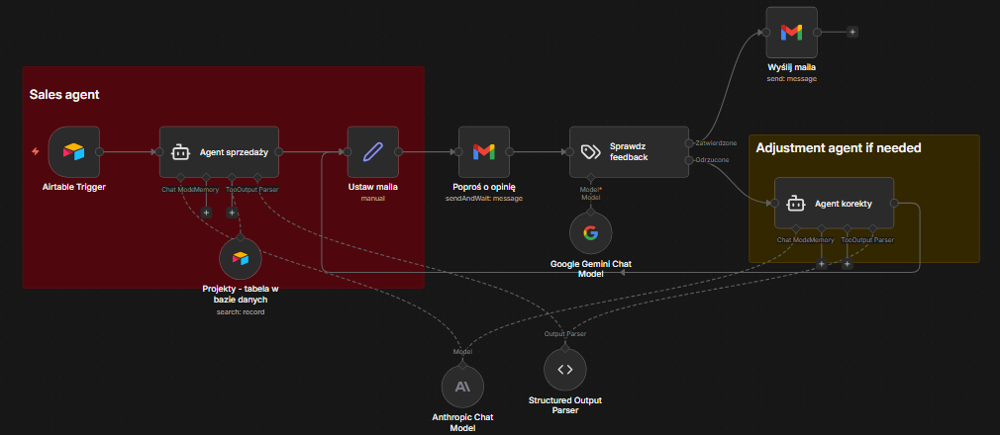

# 🤖 Human-in-the-Loop Sales Agent

*Advanced n8n workflow for automated lead nurturing with human oversight*

---

## 📌 Overview
Ten projekt to system automatyzacji AI zaprojektowany dla polskich zespołów sprzedażowych, które cenią jakość ponad masową wysyłkę. Automatyzuje proces przyjmowania leadów i tworzenia szkiców odpowiedzi, zachowując mechanizm **"Human-in-the-Loop"** – każda wiadomość czeka na zatwierdzenie przez człowieka

This project is an AI-driven automation system designed for sales teams that value quality over blind automation. It automates lead intake and drafting while keeping a human "in the loop" to review messages before they reach the customer

---

## 🚀 Key Features

* **Autonomous Research:** Uses a database of past projects (Airtable) to tailor the sales pitch to the lead's specific needs

* **Human-in-the-Loop (HITL):** Drafts are sent to your inbox first. AI only sends the final email *after* your approval

* **Intelligent Feedback Loop:** If you request changes (e.g., "Make it more professional"), a secondary AI agent analyzes your feedback and refines the draft

* **Structured Reasoning:** Utilizes `Structured Output Parsers` to ensure email subject lines and body content are separated and formatted correctly

---

## 🇵🇱 Polish Business Context
Projekt został stworzoby pod kątem **polskiego rynku handlowego**:
* **Naturalny Język:** Agent AI (Claude 3.5 Sonnet) generuje odpowiedzi w naturalnym, profesjonalnym języku polskim, unikając sztucznych kalki językowych
* **Personalizacja:** System automatycznie dobiera odpowiednie formy grzecznościowe i branżowe słownictwo specyficzne dla polskich firm
* **Elastyczność:** Idealne narzędzie dla Handlowców, Account Managerów oraz właścicieli małych agencji, którzy chcą skrócić czas reakcji na zapytanie ofertowe

---

## 🏗 Workflow Logic

*Caption: The workflow uses a feedback loop architecture, allowing human intervention at critical stages.*

### The pipeline:

1.  **Airtable Trigger:** Detects a new lead in your CRM.

2.  **Sales Agent (Claude):** Searches the project portfolio and drafts a personalized email.

3.  **Gmail Review:** Sends the draft to you for approval.

4.  **Feedback Analysis (Gemini):** Classifies your reply (Approved vs. Needs Revision).

5.  **Refinement:** If revisions are needed, the agent updates the draft. If approved, it triggers the final send.

---

## 🛠 Tech Stack
**Automation:**  n8n   
**Sales Agent:**  Claude Sonnet  
**Feedback Classifier:**  Gemini 2.0 Flash   
**Database:**  Airtable   
**Communication:**  Gmail API  

---

## ⚙️ Setup Guide

1.  **Environment:** Ensure you have an **n8n** instance running.

2.  **Import:** Download the `sales-workflow.json` file from this repo and import it into your n8n workspace.

3.  **Credentials:**

    * Set up your **Airtable API** credentials (Base/Table IDs).

    * Configure **Anthropic** (for Claude) and **Google** (for Gemini) API keys. You can change to OpenAI if you         want

    * Connect your **Gmail** OAuth2 account.

4.  **Configuration:** Update the "Sales Agent" prompt with your specific company tone and booking links.

5.  **Go Live:** Activate the workflow to start processing leads.

---

## 👨‍💻 Author

**Kajetan Hołdan**

---
